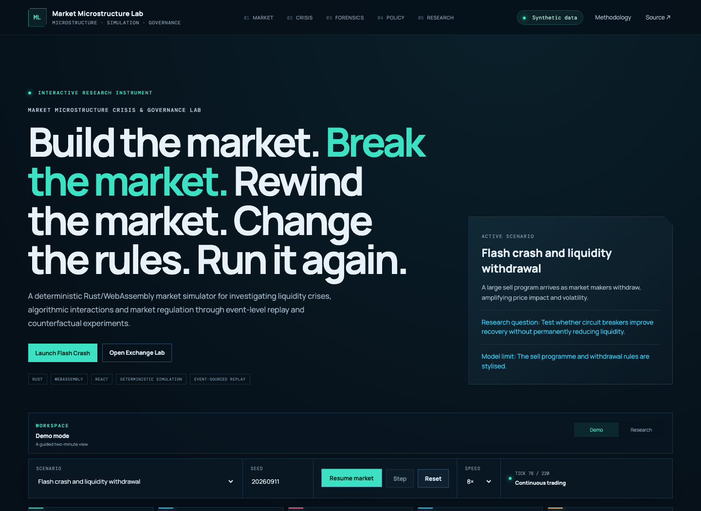

# Market Microstructure Crisis & Governance Lab

[](https://github.com/JithuVathiath/market-microstructure-crisis-lab/actions/workflows/quality.yml)
[](https://github.com/JithuVathiath/market-microstructure-crisis-lab/actions/workflows/pages.yml)
[](crates/exchange-core)
[](LICENSE)

**Build the market. Break the market. Rewind the market. Change the rules. Run it again.**

A deterministic browser laboratory for investigating how exchange design,
heterogeneous algorithmic participants, liquidity shocks, latency, and regulatory
interventions affect market quality and distributional outcomes.

> Synthetic educational simulation only. Not market data, investment advice, a
> brokerage service, or a production trading system.

## [Launch the interactive laboratory](https://jithuvathiath.github.io/market-microstructure-crisis-lab/)



## Why this is not a normal trading simulator

- **A real exchange core:** Rust compiled to WebAssembly implements price-time
  priority, partial fills, cancellation, replacement, queue ordering, halts,
  tick sizes, and maker/taker economics.
- **Event-sourced forensics:** significant exchange, agent, shock, and policy
  actions enter one canonical sequence-numbered stream. Market Time Travel
  reconstructs the book independently from those events.
- **Four-part synthetic latency:** market-data, decision, transmission, and
  exchange-processing delays have visible consequences for arrival and queue
  position.
- **Inspectable agents:** every submitted or cancelled order has an engine-derived
  decision record containing observed state, valuation, inventory risk, latency,
  strategy variables, reason, and objective.
- **Controlled policy experiments:** a baseline world and policy world share the
  same scenario and seed. The UI reports trade-offs rather than a “good/bad” label.
- **Single runs and batches:** paired Monte Carlo experiments run inside the Web
  Worker and report means, median effects, 95% simulation intervals, and the
  frequency with which an outcome improved.
- **Auditable outputs:** versioned replay JSON includes the complete event and
  decision logs; the printable incident report includes configuration, causal
  sequence, participant results, chart, policy comparison, and integrity hash.

## Architecture

```text
React research terminal
        │ commands / immutable snapshots
TypeScript Web Worker
        ├── seeded agent orchestration
        ├── latency scheduler
        ├── policy and scenario logic
        └── Monte Carlo runner
                │ JSON boundary
Rust → WebAssembly exchange core
        ├── integer-tick price representation
        ├── FIFO limit order book
        ├── matching / cancel / replace
        ├── halt / resume / fees
        └── core exchange events
                │
Canonical event store
        ├── independent replay reducer
        ├── canonical 64-bit event hash
        └── JSON replay / HTML incident report
```

The React UI never determines market outcomes. The worker owns simulation state,
and the Rust/WASM core owns exchange mechanics. See
[the architecture note](docs/architecture.md) and
[event model](docs/event-model.md).

## Signature features

### Market Time Travel

Pause at any sequence number, move one event backward or forward, or jump to the
latest trade, shock, regulatory trigger, surveillance signal, or halt. The queue
and visible order book are reconstructed from canonical events without calling
the production matcher. A separate replay-oracle test verifies the final
reconstructed book equals the original engine state.

### Queue-position inspector

Select a price level to see FIFO position, participant, remaining quantity, and
order age. Because latency changes exchange arrival time, it changes queue
priority and subsequent fills.

### Counterfactual policy engine

Holding seed and scenario constant, compare an unregulated baseline against the
selected combination of circuit breaker, speed bump, minimum resting time,
order-to-trade cap, tick size, and maker/taker fees. The comparison includes
spread, volatility, price-discovery error, drawdown, depth, slippage, fill rate,
cancellations, recovery, and a transparent resilience index.

### Agent decision records

Decision explanations are captured when strategy code acts—not generated later.
They preserve the agent's delayed observation, private valuation, inventory,
risk utilisation, latency profile, relevant market variables, reason, and
objective.

## Scenario library

| Scenario                  | Primary research question                                                     |
| ------------------------- | ----------------------------------------------------------------------------- |
| Flash crash               | Can safeguards improve recovery when a sell programme meets quote withdrawal? |
| Liquidity withdrawal      | How does execution quality deteriorate as visible depth disappears?           |
| Institutional liquidation | What impact arises from a repeated synthetic child-order schedule?            |
| Information shock         | How quickly do differently delayed agents incorporate new value?              |
| Latency race              | How does arrival speed affect queues and execution quality?                   |
| Volatility feedback       | When does momentum flow amplify a modest value shock?                         |
| Cancellation surveillance | What event signature accompanies abnormal quote cancellation?                 |
| Exchange outage           | How does the market behave through deterministic halt and restart?            |
| Tick-size regime          | What changes when new orders use a wider price increment?                     |
| Stable control            | What does normal model behaviour look like without a shock?                   |

Every scenario includes a stated limitation. See [scenario definitions](docs/scenarios.md).

## Agent ecosystem

| Agent              | Transparent objective                          | Synthetic latency profile   |
| ------------------ | ---------------------------------------------- | --------------------------- |
| Market maker       | Earn spread while controlling inventory        | Co-located / low latency    |
| Retail/noise flow  | Submit heterogeneous liquidity demand          | Retail broker / participant |
| Momentum fund      | Capture short-horizon continuation             | Institutional participant   |
| Value fund         | Trade price toward estimated value             | Institutional participant   |
| Institutional desk | Complete a parent order with controlled impact | Institutional participant   |
| Low-latency trader | Capture transient price/value differences      | Co-located algorithm        |

No LLM selects trades. Given the same seed and configuration, the rules are deterministic.

## Run locally

Requirements: Node.js 22+, pnpm 10+, and a modern browser. A compiled WASM package
is committed so normal users do not need Rust.

```bash
pnpm install --frozen-lockfile
pnpm dev
```

Open the address printed by Vite. No account, API key, server, dataset, or secret is required.

### Rebuild the Rust/WASM core

Install the stable Rust toolchain, the `wasm32-unknown-unknown` target, and
`wasm-pack`, then run:

```bash
pnpm wasm:build
```

## Verification

```bash
pnpm format:check
pnpm lint
pnpm typecheck
pnpm test
pnpm rust:format:check
pnpm rust:lint
pnpm rust:test
pnpm wasm:build
pnpm build
pnpm e2e
pnpm benchmark
```

CI executes frontend formatting, linting, type checks, unit/coverage tests,
production build, Rust formatting, Clippy with warnings denied, Rust unit and
property tests, a fresh WASM build, and browser smoke tests.

## Replay format

Replay schema v2 stores application/engine versions, seed, exchange and policy
configuration, canonical event stream, decision log, integrity hash, final
snapshot, metrics, and disclaimer. The app validates the hash before importing.
See [replay and event model documentation](docs/event-model.md).

## Performance snapshot

The checked-in local benchmark processed 10,000 orders through the release
Rust/WASM core at approximately **147,500 orders/second** and replayed canonical
events through the independent reducer at approximately **15.9 million
events/second** on the development host. See
[the benchmark record and methodology](reports/benchmark.md); results vary by
hardware and are not a latency claim for a production venue.

## Example research workflow

1. Run **Flash crash** with a recorded seed.
2. Inspect the event-backed causal chain and reconstruct the book at the shock.
3. Open the related agent decision record and queue level.
4. Change a policy parameter and run the paired comparison.
5. Run 25 or 50 paired seeds in Research Mode.
6. Export the replay and incident report with all assumptions attached.

Treat a single replay as an example. Treat a batch as evidence about this model,
not about real markets.

## Repository structure

```text
crates/exchange-core/   Rust matching engine, WASM boundary, property tests
src/engine/             agents, scenarios, policies, event store, replay, metrics
src/wasm/pkg/           reproducible browser WASM package
src/components/         terminal, forensics, policy and research surfaces
src/hooks/              worker-backed application state
tests/e2e/              Playwright user journeys
docs/                   architecture, model, metrics, scenarios and limitations
.github/workflows/      quality and GitHub Pages automation
```

## Documentation

- [Architecture](docs/architecture.md)
- [Matching engine](docs/matching-engine.md)
- [Event model and replay](docs/event-model.md)
- [Model and agents](docs/MODEL.md)
- [Metrics](docs/metrics.md)
- [Scenarios](docs/scenarios.md)
- [Determinism and testing](docs/determinism-and-testing.md)
- [Experiment guide](docs/EXPERIMENTS.md)
- [Limitations](docs/limitations.md)

## Intentional limitations

The lab is discrete logical time, not an empirically calibrated venue. It has a
single lit book, stylised agents, visible liquidity, an exogenous fundamental
process, and no smart routing, hidden orders, learning agents, network topology,
or real brokerage connection. Simulation intervals describe seeds in this model;
they are not confidence intervals for a population of real markets.

## Roadmap

The highest-value future additions are mid-simulation branch worlds, a reopening
auction, reference-matcher differential fuzzing, and richer institutional TWAP /
VWAP / POV execution research. These are deliberately excluded from v2 until
they can be added without weakening deterministic correctness.

## Author

**Jithu Vathiath Biju** — quantitative research, FinTech, financial risk, data
science, responsible technology, and technology strategy.

## License

[MIT](LICENSE)
