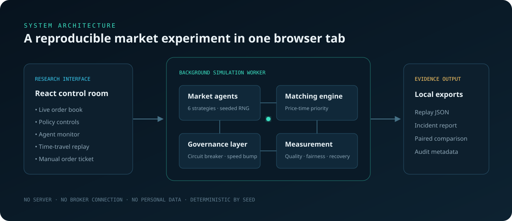

# Market Microstructure Crisis & Governance Lab

[](https://github.com/JithuVathiath/market-microstructure-crisis-lab/actions/workflows/quality.yml)
[](https://github.com/JithuVathiath/market-microstructure-crisis-lab/actions/workflows/pages.yml)
[](LICENSE)
[](docs/MODEL.md)

**Build the market. Stress the market. Govern the market.**

An interactive browser research instrument for exploring how trading behavior, liquidity shocks, and market rules interact inside a central limit order book. Change the rules while the model runs, inspect any previous tick, place a human order, and compare the same crisis with and without governance interventions.

> Synthetic educational simulation only. Not market data, investment advice, or a trading system.

## [Launch the live laboratory](https://jithuvathiath.github.io/market-microstructure-crisis-lab/)




## Why this is more than a trading simulator

- **Market microstructure engine:** price-time priority, partial fills, maker/taker fees, cash and inventory constraints, and multi-level liquidity.
- **Heterogeneous participants:** market makers, retail/noise flow, momentum and value funds, an institutional execution desk, and a low-latency trader.
- **Crisis laboratory:** flash crash, liquidity drought, information shock, latency race, and a stable control.
- **Governance workbench:** live circuit-breaker, speed-bump, resting-time, and cancellation-ratio controls.
- **Controlled counterfactuals:** the same shock and random seed run under an unregulated baseline and the chosen intervention.
- **Explainable evidence:** agent decisions, incident alerts, time-travel snapshots, replay JSON, and a standalone incident report.
- **Production engineering:** Web Worker isolation, deterministic tests, coverage thresholds, end-to-end browser tests, CI, and automated GitHub Pages deployment.

## Questions the lab can explore

1. When does liquidity withdrawal turn a large order into a flash crash?
2. Does a circuit breaker aid recovery or only postpone price discovery?
3. Can a speed bump reduce latency advantage without damaging ordinary execution?
4. When is rapid repricing after new information efficient rather than disorderly?
5. How do market-design rules redistribute P&L, fill rates, and slippage across participant types?

## Run locally

Requires Node.js 22+ and pnpm 10+.

```bash
pnpm install
pnpm dev
```

Open the local address printed in the terminal. No API key, dataset, account, or server is required.

## Verification

```bash
pnpm format:check
pnpm lint
pnpm typecheck
pnpm test
pnpm build
pnpm exec playwright install chromium
pnpm e2e
pnpm benchmark
```

## Architecture

The React interface never performs simulation work on the render thread. It sends serialisable commands to a dedicated Web Worker. The worker owns the seeded random generator, participant states, matching engine, market policies, and metrics. This keeps high-speed runs responsive and makes engine tests independent of the interface.

The application is fully client-side: experiment data stays in the browser and exports are created locally.

## Research transparency

- [Model specification and limitations](docs/MODEL.md)
- [Reproducible experiment guide](docs/EXPERIMENTS.md)
- [Contribution guide](CONTRIBUTING.md)
- [Security policy](SECURITY.md)

The model is intentionally stylised. A fixed seed makes a computational experiment reproducible, but it does not make the simulation empirically calibrated or its result externally valid. General claims should be based on many seeds, clearly reported assumptions, and comparison with empirical research.

## Technology

TypeScript · React · Web Workers · SVG · Vite · Vitest · Playwright · GitHub Actions · GitHub Pages

## Author

**Jithu Vathiath Biju** — data science, financial risk, FinTech, AI governance, and technology strategy.

## License

[MIT](LICENSE)
